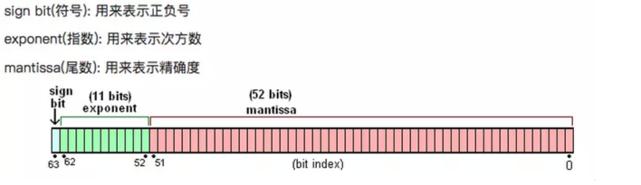

#JavaScript中神奇的浮点数
##神奇的由来
###首先介绍几个JS中的方法，下文会提到，做个基础铺垫
```javascript
NumberObject.toString(radix) // 把数字转化为radix进制的数，默认10进制
NumberObject.toFixed(x) // 四舍五入,x为保留的位数
Math.round(x)  // 四舍五入，x为保留的位数
(num).toPrecision(位数) // num保留有效位数
parseInt(num) // 解析num，并返回一个整数
```

###为什么会说是神奇的浮点数计算，看下面几个例子
```javascript
0.1 + 0.2 === 0.3  // false
(0.1 + 0.2).toString() // 0.30000000000000004                                                                      
```
为什么0.1+0.2的结果不是0.3，而是0.30000000000000004，下面就来解释这个问题的由来。

解释这个问题的由来，不得不说一下JavaScript中浮点数的存储方式。JS中Number类型使用的是双精度浮点型，用64 bit来进行存储，结构图如下：

浮点数的实际值：`value = sign * mantissa * 2^exponent`

0.1转化成具有52位有效数字的二进制数应该是什么呢？十进制数转化为二进制，整数部分除2取余，小数部分乘以2，取小数点前的数，比如0.1 * 2 = 0.2 ，所以0.1转化为二进制的第一个数就是0，依此继续将结果小数部分乘以2，取整数部分，一直到取到52位有效数字的时候发现，小数部分还是有值，不是0，这说明什么问题？0.1不能被精确表示，我们得到的有52位有效数字的二进制数并不是完全等于0.1，而是一个接近0.1的数。同样的，我们将0.2转化成具有52位有效数字的二进制数，同样发现，0.2也不能被计算机精确表示。那么我们将两个表示0.1和0.2的二进制数相加，得到的结果转化为10进制，就是开始说的那个数字0.30000000000000004。
```
(0.1).toString(2)  // 0.000 1100 1100 1100 1100 1100 1100 1100 1100 1100 1100 1100 1100 1101
(0.2).toString(2)  // 0.001100110011001100110011001100110011001100110011001101
(0.1 + 0.2) // 0.0100110011001100110011001100110011001100110011001100111 
```
那什么样的小数才可以被精确表示呢？尾数是0或者5的小数。也就是0.1~0.9，只有0.5可以被二进制精确表示。也就是说在JS的数值范围内，可以被精确表示的数是有限的。这就导致了各种计算误差。

##如何用JS做精确的数值计算
1. 引入第三方工具库
网上有很多小巧精炼的第三方库，可以直接使用
2. 先将数值扩大相应的倍数，再使用Math.round方法。
例：Math.round( item.price * 100 ) / 100  ； round方法把数值四舍五入为最接近的整数
3. 使用toFixed方法和toPrecision方法，但是这两个方法存在同样的问题，可以把两个方法进行重写再使用。
```
(0.15).toFixed(1) // 0.1
(0.15).toPrecision(1) // 0.1

同样有问题的还有parseInt方法，因此使用的时候要格外注意。
parseInt(0.00000008) // 8  
```
4. 使用Number.EPSILON限定阈值（内容引自阮一峰《ECMAScript 入门》章节6.5）
ES6 在Number对象上面，新增一个极小的常量Number.EPSILON。根据规格，它表示 1 与大于 1 的最小浮点数之间的差。对于 64 位浮点数来说，大于 1 的最小浮点数相当于二进制的1.00..001，小数点后面有连续 51 个零。这个值减去 1 之后，就等于 2 的 -52 次方。
```
function withinErrorMargin (left, right) {
  return Math.abs(left - right) < Number.EPSILON * Math.pow(2, 2);
}

0.1 + 0.2 === 0.3 // false
withinErrorMargin(0.1 + 0.2, 0.3) // true

1.1 + 1.3 === 2.4 // false
withinErrorMargin(1.1 + 1.3, 2.4) // true
```
限定阈值后可以重写运算，以使其达到我们想要的效果。

后记：关于浮点数运算没有说其安全数以及绝对值范围，以下参考资料中的内容有涉及，可以自行查看。

##参考资料
1. 清晰简洁的介绍浮点数为什么会丢失精度的问题： https://juejin.im/post/5a6fce10f265da3e261c3c71
2. 谁偷了你的精度：http://justjavac.iteye.com/blog/1724438
3. IEEE 754规范 https://zh.wikipedia.org/wiki/IEEE_754
4. 双精度浮点数 https://0x9.me/VBOH1


